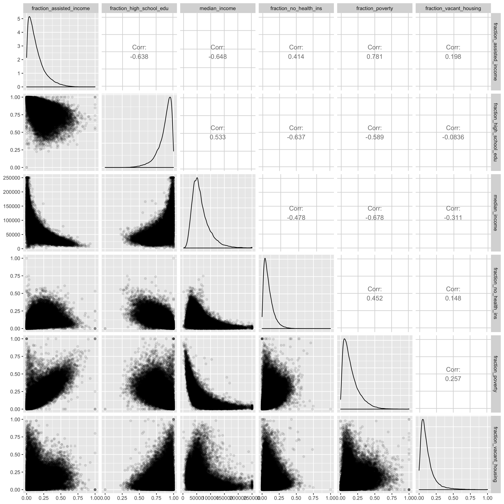
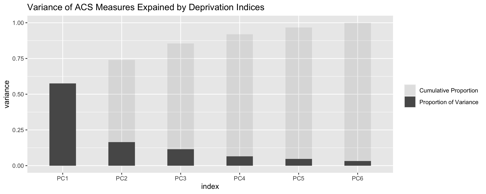
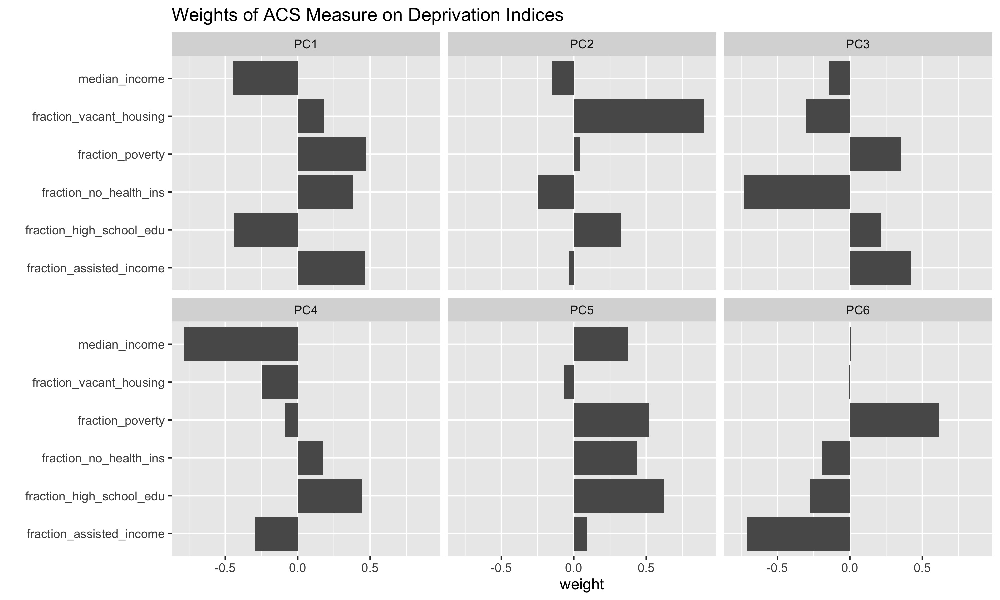
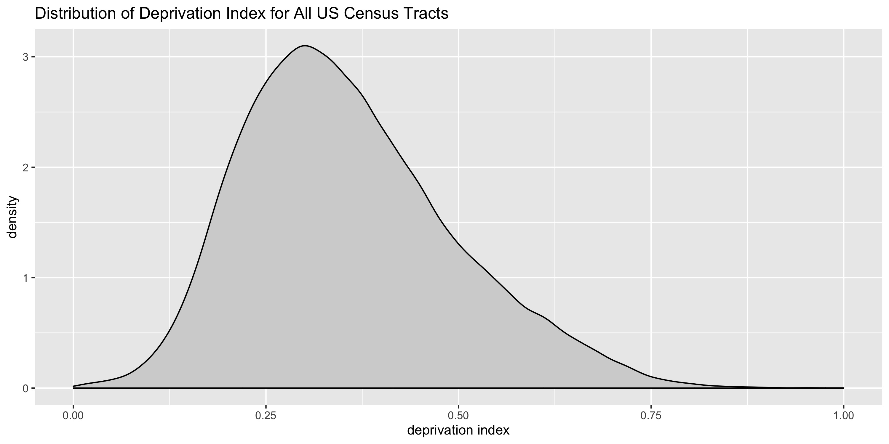
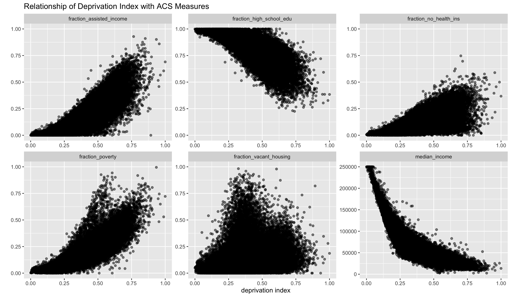

# A Nationwide Community Deprivation Index

Please see the main [README](../README.md) for methodological details.  This document only contains output relevant to the update from the 2015 version of the index to the 2018 version.

## Getting the data

### Download the 2018 index CSV file

The data is contained in a CSV file called [ACS_deprivation_index_by_census_tracts.csv](https://github.com/geomarker-io/dep_index/raw/master/2018_dep_index/ACS_deprivation_index_by_census_tracts.csv) which is a table of census tracts listed by their FIPS ID and corresponding deprivation index.  Also included for each tract are the six individual ACS measures used to create the deprivation index.

### Import 2018 index directly into `R`

Use the following code to download the deprivation index data.frame directly into R:

```
dep_index <- 'https://github.com/geomarker-io/dep_index/raw/master/2018_dep_index/ACS_deprivation_index_by_census_tracts.rds' %>% 
    url() %>% 
    gzcon() %>% 
    readRDS() %>% 
    as_tibble()
```

## 2018 ZIP code deprivation index

The deprivation index is also available by zip codes, denoted using the [ZIP Code Tabulation Area (ZCTA)](https://en.wikipedia.org/wiki/ZIP_Code_Tabulation_Area) boundaries. The value for each ZCTA is calculated as the mean of all of its intersecting census tracts. Download the 2018 file located at `2018_dep_index/ACS_deprivation_index_by_zipcode.csv` or use the above code to read it into R by replacing the RDS file name with `ACS_deprivation_index_by_zipcode.rds`.

## Updated PCA results for 2018 ACS data

### Pairs plot of ACS estimates



### PCA





### Distribution of index



### Relationship between index and ACS measure


