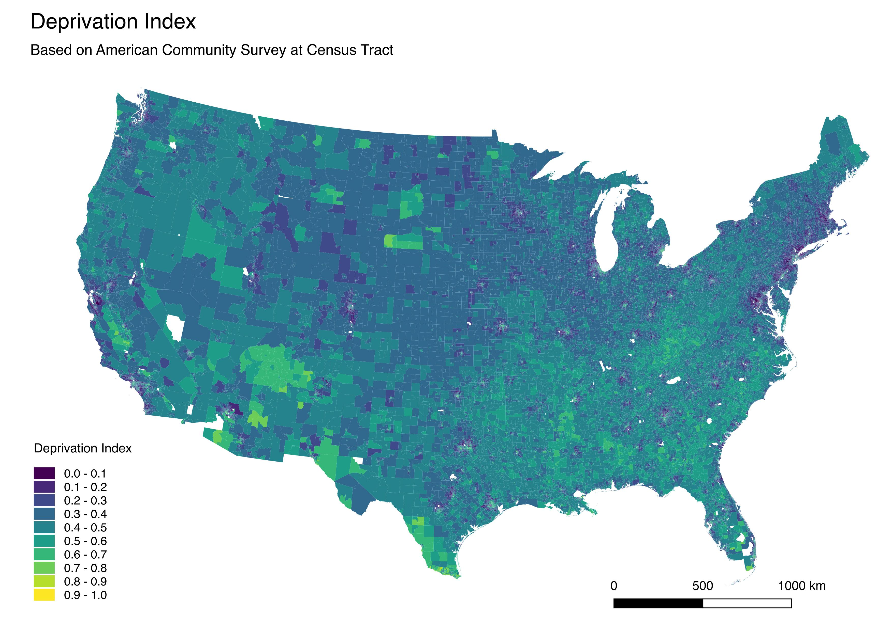
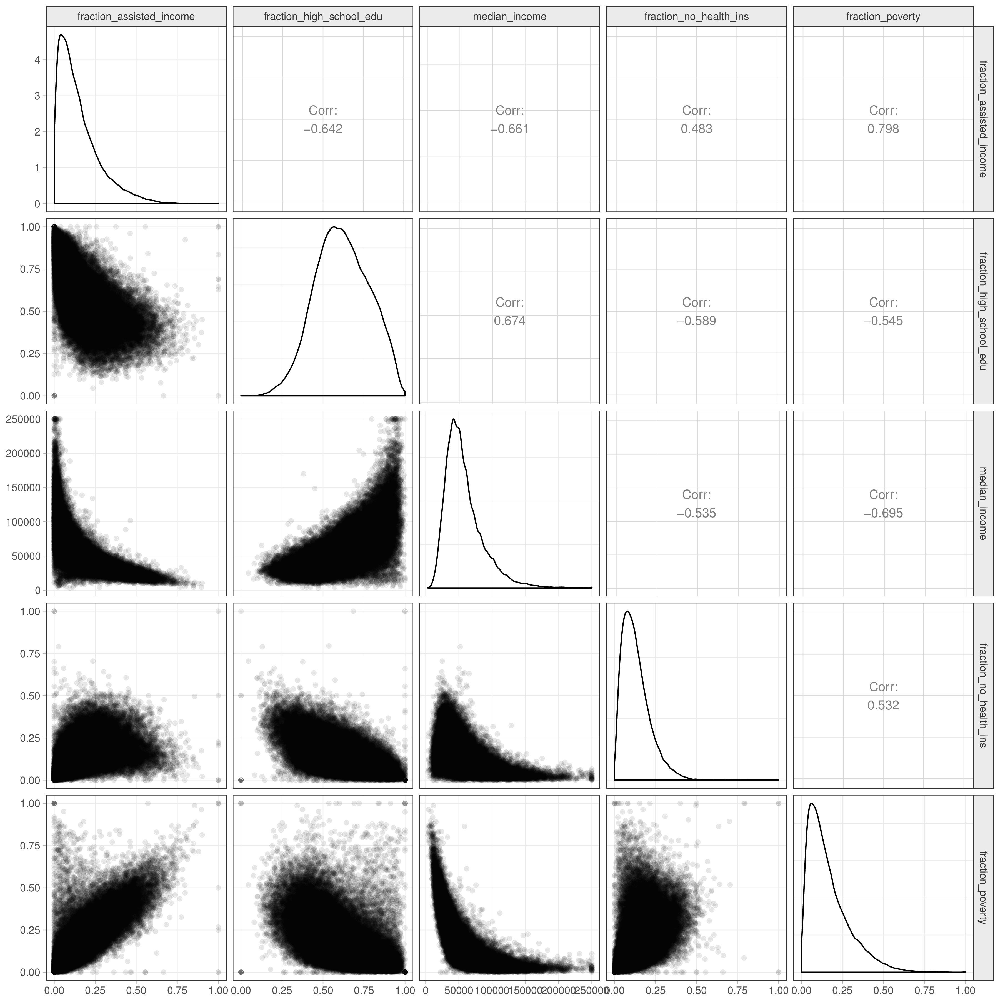
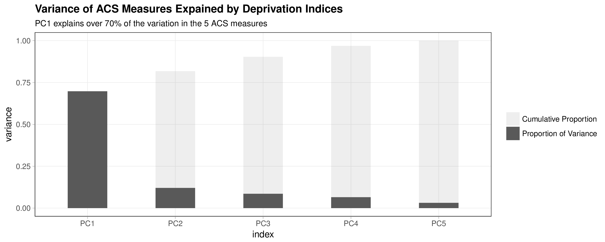
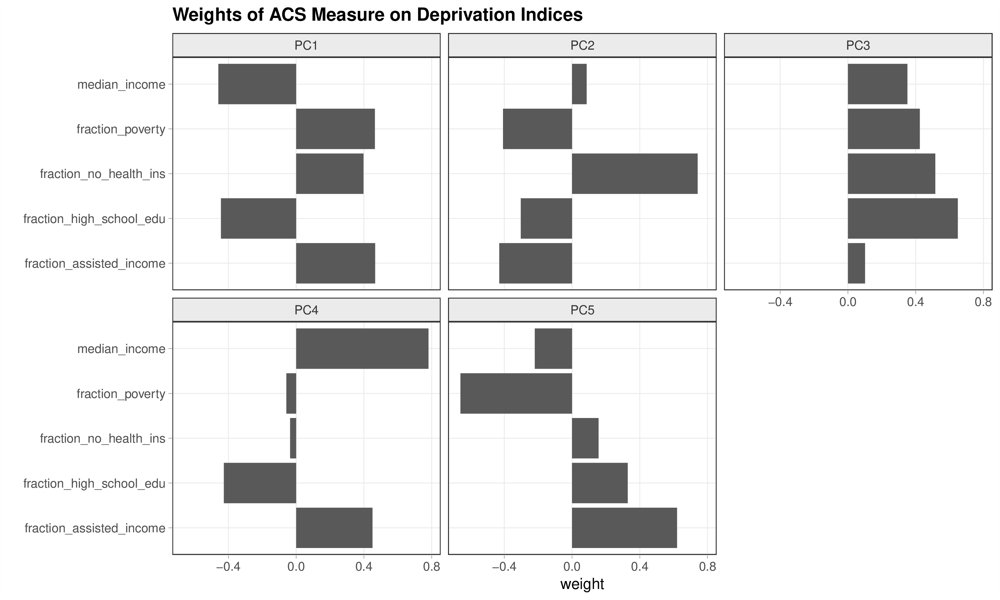
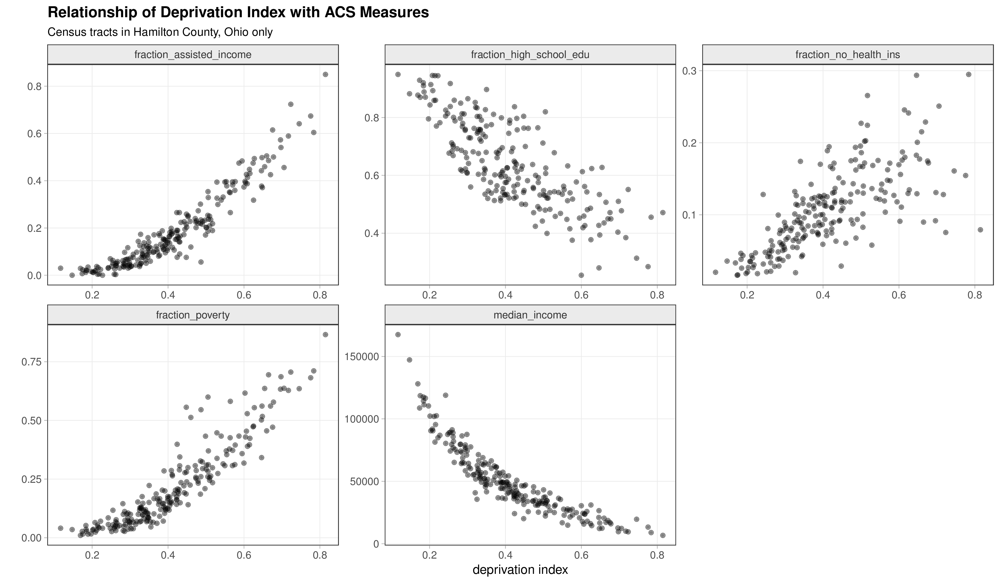

# A Nationwide Community Deprivation Index

**Cole Brokamp**  
cole.brokamp@cchmc.org

 

## Overview

Socioeconomic variables from the American Community Survey (ACS) are frequently used in place of or in addition to individual confounders in observational studies. There are several census tract level measures that can be used to capture "community deprivation" and they are often highly correlated, e.g., median household income and educational attainment. Choosing only one ACS measure might not capture the entirety of community deprivation, but using more than one ACS measure can lead to problems in statistical models due to colinearity. 

Here, we create a deprivation index for each census tract in the United States based on a principal components analysis of six different 2015 ACS measures. The first component explains over 60% of the total variance present in the five different ACS measures and is dubbed the "Deprivation Index". Rescaling and normalizing forces the index to range from 0 to 1, with a higher index being more deprived.

The high resolution of the tract level is masked when using a nationwide scale. Below is an example of how the index looks across the Greater Cincinnati, Ohio area:

The data is in a CSV file (`ACS_deprivation_index_by_census_tracts.csv`) which is a table of 73,056 census tracts listed by their FIPS ID and corresponding deprivation index.  Also included for each tract are the six individual ACS measures used to create the deprivation index.

## Details on Creating the Index

The following census tract level variables were derived from the 2015 5-year American Community Survey:

- `fraction_poverty`: fraction of households with income in past 12 months below poverty level
- `median_income`: median household income in the past 12 months in 2015 inflation-adjusted dollars
- `fraction_high_school_edu`: fraction of population 25 and older with educational attainment of at least high school graduation (includes GED equivalency)
- `fraction_no_health_ins`: fraction of poulation with no health insurance coverage
- `acs_assisted_income`: fraction of households receiving public assistance income or food stamps or SNAP in the past 12 months
- `fraction_vacant_housing`: fraction of houses that are vacant

Looking at a pairs plot of all the ACS estimates, we can see that they are mostly highly correlated with one another:

Carrying out a principal component analysis results in six components, with the first explaining over 70% of the total variance in the six ACS measures:

Looking at the loading weights used to calculate the principal components, we can see that (other than the fraction of vacant housing) the first component is somewhat equally weighted by each ACS measure, each in the expected direction such that a higher first component value is associated with higher deprivation.

The first component is dubbed the "Deprivation Index"; rescaling and normalizing forces the index to range from 0 to 1, with a higher index being more deprived.

Applying the weights to the data for all census tracts leads to a deprivation index assignment for US census tracts with non-missing ACS measures.  999 of the 73,056 total US census tracts have a missing value for the deprivation index because of a missing value for one or more of the underlying ACS measures.

We can verify the relationship between the deprivation index and each of the ACS measures individually with scatter plots:

## Reproducibility

`01_make_data_for_dep_index.R` is used to fetch the ACS census tract level data and then `02_pca_on_dep_index_data.R` is used to carry out the principal components analysis, create the deprivation index, and create the images used in this document.
