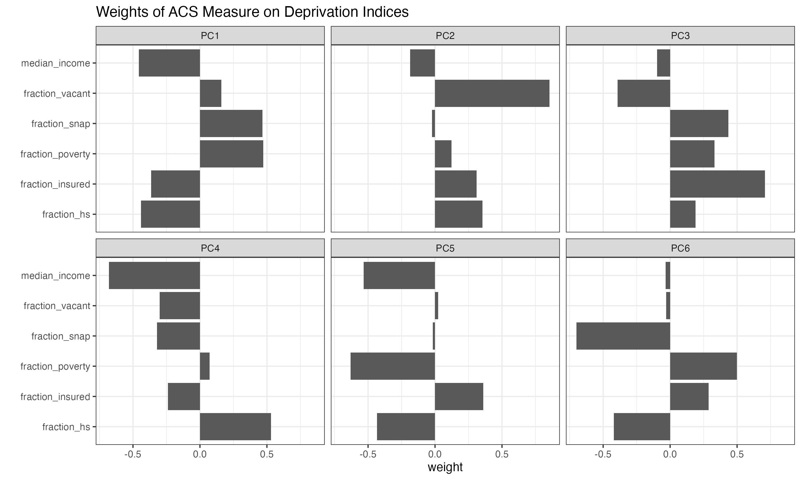
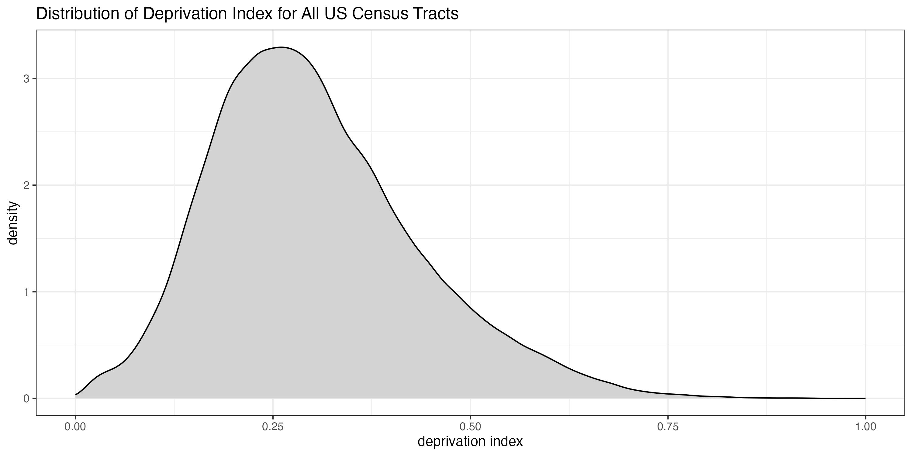
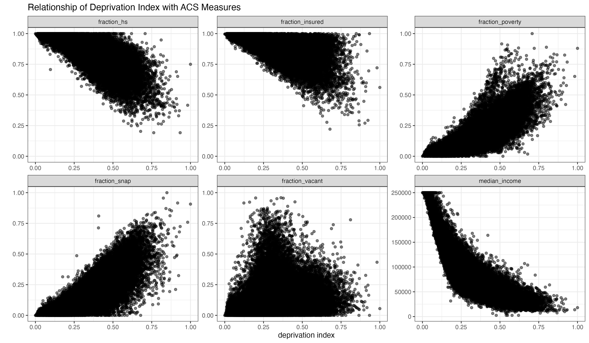

# A Nationwide Community Deprivation Index

 [](http://www.gnu.org/licenses/gpl-3.0)

**Citation for Scientific Publications:**  If you use the deprivation index in a scientific publication, please cite our manuscript detailing its creation and application to health outcomes:

> Cole Brokamp, Andrew F. Beck, Neera K. Goyal, Patrick Ryan, James M. Greenberg, Eric S. Hall. Material Community Deprivation and Hospital Utilization During the First Year of Life: An Urban Population-Based Cohort Study. *Annals of Epidemiology*. 30. 37-43. 2019. [Download](https://colebrokamp-website.s3.amazonaws.com/publications/Brokamp_AoE_2019.pdf).

--------------------------------------------

## Overview

Socioeconomic variables from the American Community Survey (ACS) are frequently used in place of or in addition to individual confounders in observational studies. There are several census tract level measures that can be used to capture "community deprivation" and they are often highly correlated, e.g., median household income and educational attainment. Choosing only one ACS measure might not capture the entirety of community deprivation, but using more than one ACS measure can lead to problems in statistical models due to colinearity. 

We've created a 2015, 2018, and 2023 deprivation index for each census tract in the United States based on a principal components analysis of six different measures from the 2015, 2018, and 2023 ACS, respectively. The first component explains over 52% to 60% of the total variance present in the six different ACS measures and is dubbed the "Deprivation Index". Rescaling and normalizing forces the index to range from 0 to 1, with a higher index being more deprived.


The high resolution of the tract level is masked when using a nationwide scale. Below is an example of how the index looks across the Greater Cincinnati, Ohio area:


## Getting the data

### Download the 2023 Deprivation Index CSV file

The data is contained in CSV files called [ACS_deprivation_index_by_census_tracts.csv](https://github.com/geomarker-io/dep_index/raw/master/2023/dataACS_deprivation_index_by_census_tracts.csv) stored in the `data/` folder within the directory for the corresponding deprivation index vintage (2015, 2018, or 2023). The data is a table of all census tracts listed by their FIPS ID, deprivation index, and the six individual ACS measures used to create the deprivation index.

### Import the 2023 Deprivation Index Directly Into `R`

Use the following code to read the 2023 deprivation index data.frame directly into R:

```
dep_index <- 'https://github.com/geomarker-io/dep_index/raw/master/2023/data/ACS_deprivation_index_by_census_tracts.rds' %>% 
    url() %>% 
    gzcon() %>% 
    readRDS() %>% 
    as_tibble()
```

Alternatively, change the year in the url above to read in the 2015 or 2018 deprivation index.

### ZIP Code Deprivation Index

The deprivation index is also available by zip codes, denoted using the [ZIP Code Tabulation Area (ZCTA)](https://en.wikipedia.org/wiki/ZIP_Code_Tabulation_Area) boundaries. The value for each ZCTA is calculated as the mean of all of its intersecting census tracts. Download the file called `ACS_deprivation_index_by_zipcode.csv` or use the above code to read it into R by replacing the RDS file name with `ACS_deprivation_index_by_zipcode.rds`.

## Details on Creating the Index

The following census tract level variables were derived from the 2023 5-year American Community Survey:

- `fraction_poverty`: fraction of households with income below poverty level within the past 12 months
- `median_income`: median household income in the past 12 months in 2023 inflation-adjusted dollars
- `fraction_hs`: fraction of population 25 and older with educational attainment of at least high school graduation (includes GED equivalency)
- `fraction_insured`: fraction of population with health insurance
- `fraction_snap`: fraction of households receiving public assistance income or food stamps/SNAP in the past 12 months
- `fraction_vacant`: fraction of houses that are vacant

Looking at a pairs plot of all the ACS estimates, we can see that they are mostly highly correlated with one another:


Carrying out a principal component analysis results in six components, with the first explaining over 50% of the total variance in the six ACS measures:


Looking at the loading weights used to calculate the principal components, we can see that (other than the fraction of vacant housing) the first component is somewhat equally weighted by each ACS measure, each in the expected direction such that a higher first component value is associated with higher deprivation.

The first component is dubbed the "Deprivation Index"; rescaling and normalizing forces the index to range from 0 to 1, with a higher index being more deprived.



Applying the weights to the data for all census tracts leads to a deprivation index assignment for US census tracts with non-missing ACS measures. 2,075 of the 84,122 total 2020 US census tracts have a missing value for the deprivation index because of a missing value for one or more of the underlying ACS measures.



We can verify the relationship between the deprivation index and each of the ACS measures individually with scatter plots:



## Deprivation Index Vintages

The first deprivation index was calculated using 2015 ACS data. The same methods were used to create 2018 and 2023 deprivation index vintages. The above plots for each vintage can be found in the `figs/` folder of each vintage directory.

The 2015 and 2018 deprivation indices use 2010 census tract boundaries, while the 2023 deprivation index was calculated using 2020 census tract boundaries.

Deprivation index values should not be compared across different vintages, as the values are rescaled within each vintage. Rather, the deprivation index is meant to compare census tracts within the same vintage.

We calculated the nationwide summary statistics for the deprivation index by weighting each tract-level deprivation index by its population under age 18. Details are in the [weighted_avg/dep_index_pop_under_18_weighted_avg.R](weighted_avg/dep_index_pop_under_18_weighted_avg.R) file.

|year | mean|   sd|  p25| median|  p75| 
|:----|----:|----:|----:|------:|----:| 
|2015 | 0.38| 0.14| 0.27|   0.36| 0.47| 
|2018 | 0.35| 0.14| 0.25|   0.33| 0.44| 
|2023 | 0.30| 0.14| 0.20|   0.28| 0.38|
